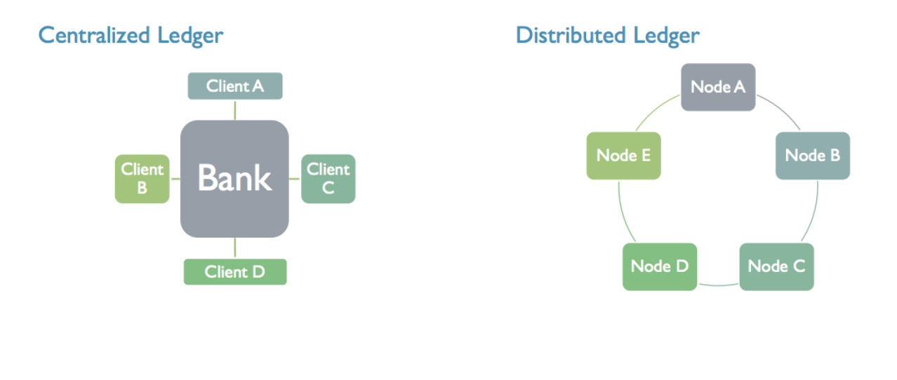
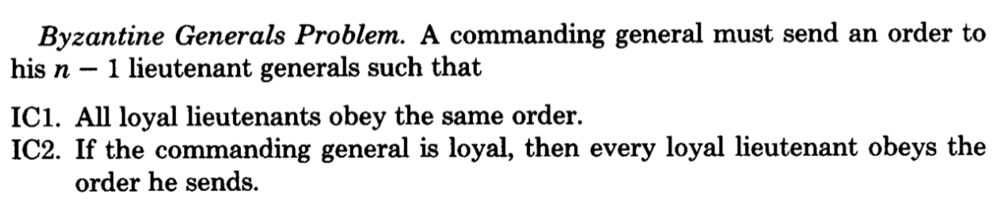
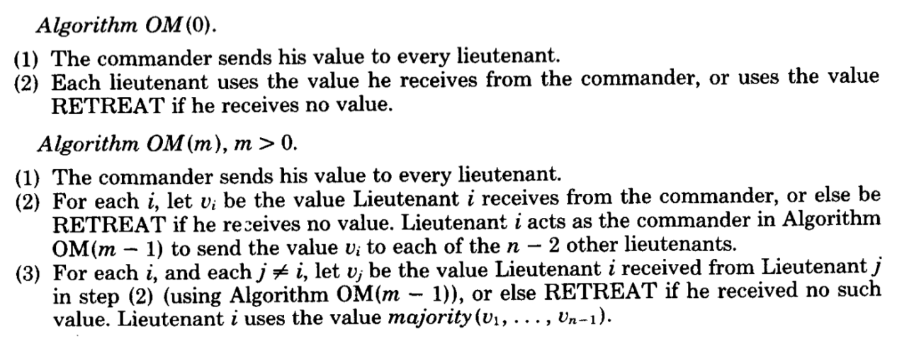

.. _custom_look:

******************************************
Part 2: Blockchain 101
******************************************
Blockchain fundamentals
=============================
What is blockchain?
-----------------
Bitcoin, Ethereum, Cryptocurrencies. These are all words that we have heard thrown around mainstream media, with people quickly becoming millionaires, $100k digital cats, and the promises of bankless currencies with a market cap of over $100 billion dollars. The technology that makes all of this possible is blockchain, so what is it?

Blockchain is a decentralized ledger technology (DLT). It is a shared digital ledger that is not stored in a central source but instead is distributed amongst different nodes. In other words, the distributed ledger is a database that is independently stored and updated by each node in the network. Records for the ledger are constructed by each node based on transactions broadcasted on the network, instead of being distributed by a central authority. Hence, each node in the network processes every transaction, draws a conclusion on it, then votes amongst these conclusions created by the different nodes to determine the majority approved conclusion. This majority approved conclusion is the determined true ledger state of the network.

In simpler terms, the blockchain is a list of transactions that all parties can inspect but no one can control. In other words, a distributed database that is secure from tampering and revision. One can think of it as a giant file that records all transactions made.
In the centralized ledger there is a “golden record” held by the Bank, and individual ledgers held by each client. Any client must reconcile its own ledger against that of the central source, bank, and must convince the bank of the “true state” of the ledger if any discrepancies arise.

Look at the following graphic.

In the distributed ledger variant, there is only a single ledger. All nodes have access to this shared ledger. Using a protocol, all nodes determine the “true state” of the ledger at any point in time. The application of this protocol is sometimes known as “achieving consensus”.

Blockchain was originally created as the underlying technology for Bitcoin, a digital currency, but people have found numerous applications outside of its original intention. The name itself is derived from being a chain of blocks, where each block is a group of transactions. We will cover this more in the technical section.

Let’s use Google Docs as an analogy for a distributed shared ledger. In a dated method to collaborate on a Word document with friends, you must create the document on your computer then share it to your friends by sending it or via USB. While the document is being edited by others, you must wait until the new version is sent back to you. During this time period, you are locked out of the document, cannot see changes, nor make any additional edits until it is sent back. This is similar to how current databases work today where multiple people cannot access or edit the same record at once. With Google Docs, multiple parties have access to the document at the same time, and a single version is always visible to all parties.

Let’s also look at Wikipedia for another example. A Wikipedia user with admin permissions can change Wikipedia articles as they are stored on a centralized database. Whenever a regular user accesses a Wikipedia article, they get the most recent version of the Wikipedia article stored on the database. This is the master copy. The database is controlled by Wikipedia admins, a central authority, who control permissions, access and edits to entries.

A distributed Wikipedia built on blockchain technology is fundamentally different than the above described version. In this distributed version, when a user makes a change, the change is broadcasted to each user, who updates their record independently and agree on the true version of the article. Every user has their own copy of Wikipedia. If someone tries to tamper with Wikipedia, they technically have to change everyone’s version opposed to just the central database.

Blockchain protocol regulate the rulesets and mechanisms in a blockchain. Since the blockchain is shared and not controlled by a single party, its governance is predetermined by the protocol. There are multiple protocols, each with different objectives and mechanisms. This allows increasingly varied use cases for blockchain, as some are built for monetary transactions like Bitcoin, while others for a decentralized application platform like Ethereum. Before delving more into protocols let’s look at why we need a governance protocol.

Byzantine Fault Tolerance
-----------------

Since blockchains are decentralized by nature, there needs to be mechanisms and incentives in place for processes to run smoothly. Different participants or actors have different incentives and access to information on the blockchain. In the event that a transaction occurs on the network, nodes have the option to add to add the transaction to their ledger or not. When the majority of nodes determine the same state of the ledger, they achieve consensus for the network. This addresses one of the major problems in distributed systems, which is to achieve system reliability despite faulty processes. This means that there needs to be processes for agreed data values, hence consensus.

Let’s consider this though: What happens when there are multiple actors who are malicious and do not want to follow the rules and change the blockchain ledger?

To prevent this, the consensus method used must be fault-tolerant and secure.

The Two General Problem
-----------------
The Two General Problem, created in 1975, is a scenario which describes two generals who are attacking an enemy force. The first general, Alice, is considered the leader and the other is the follower, Bob. As a combined force, they are strong enough to defeat the enemy if they attack at the same time. However, if they attack at separate times, they will fail and both generals will be routed. To send a message to Bob for when to attack, Alice must send a messenger through the enemy camp to reach Bob’s forces. Since the messenger has to travel through the enemy, there is a chance that the enemy can capture the messenger and the message never makes it through. Hence if Alice says attack at 1PM and the messenger never makes it to Bob so he decides not to attack, both armies will be routed.

This simple problem is in fact unsolvable. Even if Alice’s messenger makes it to Bob, he must send a messenger to verify that he received the appropriate message to Alice. Bob’s messenger might not make it though, and this process can continue indefinitely without 100% confirmation of the plan. As we can see, it is difficult to create a trusted system with just two nodes, but let’s look at if we expand the number of nodes.

The Byzantine General Problem:
-----------------
The Byzantine General Problem is a scenario created in 1982 to address the reliability of a computer system. A spin on the the Two General Problem, there are multiple generals that need to agree on a strategy to attack their shared target. However, one of the generals is a traitor, and intends to act maliciously to doom the other generals by lying about his strategy. For example, if they agree to attack at the same time, but the malicious general does not, the attack fails and the other generals are routed.

Along with adding more generals, the leader-follower system is now a general-lieutenant system. For success and consensus to be achieved, everyone must agree on the same strategy.

To add onto this, if the general is a traitor, then lieutenants must take the majority vote. This vote is taken by lieutenants making a decision by actions they witness.

The algorithm shows that as long as two-thirds of all actors are honest, then consensus can be achieved. In the end result, regardless of whether the commander or a lieutenant is a traitor, all lieutenants arrive on the same decision, may not be the right or specific decision, but the same. This is the goal of achieving consensus.

Byzantine fault tolerant (BFT) is a system which handles the issues presented in the Byzantine General Problem. This algorithm is only BFT if the traitors do not exceed one third of the generals. BFT is essential for blockchain since they are not controlled by a central authority. There are large incentives for bad actors to influence transactions, ranging from manipulating data to stealing millions of dollars worth of cryptocurrency. When Bitcoin was created, the Proof of Work protocol was used in consideration of BFT and ultimately creating a secure blockchain.

Blockchains elect a leader who determines the contents of the next transaction block. This block is then broadcasted across the network where it is verified by other nodes.

Blockchain protocol
=============================
Proof of Work
-----------------
Proof of Work is the protocol used in the Bitcoin and current Ethereum blockchains. For a leader to be selected, they have to find to solve a specific math problem. This mathematical problem is cryptographically secure utilizing hashes and can only be solved by brute force. Therefore, usually the first node to solve the problem is the one with the most computing power. People who engage in this activity are known as miners. When a block is mined, the miner receives an incentive (block rewards and transaction costs in the form of the blockchain’s native digital currency like BTC). Other nodes who failed to solve the problem then check the validity of the block. Miners are incentivized not to cheat as there is a high energy cost to tamper with the network and loss of block rewards. A miner would need to achieve 51% of the total network hashing power to successfully control transactions and tamper with the network. This is known as a 51% attack.

Proof of Work is secure and is proven to be an effective protocol. The major downside is major consumption of energy.

Proof of Stake
-----------------
Next is Proof of Stake, another BFT blockchain protocol and which Tezos uses a variant of. Let’s summarize Proof of Work as if Alice has more computing power than Bob, she has a higher chance of being the leader and mining the next block. In Proof of Stake, if Alice has more stake than Bob, she is more likely to mine the next block.

Proof of Stake removes the competition of energy and computational power from Proof of Work and replaces it with stake. Stake is the amount of currency (native currency of blockchain) that a participant is willing to lock up for a set amount of time. In return, this participant has a higher chance to be selected next as the leader, and hence receives the rewards.

Take aways
=============================

To finish this section, let’s list some commonly mentioned characteristics of blockchain:

Immutable

Transparent

Trustless

Automated

The immutable nature is due to the tamperproof nature of the shared ledger, where malicious actors cannot modify past transactions. The blockchain is transparent because all transactions are seen by all parties, past and current. Blockchain protocol allows the blockchain to be trustless, as involved parties do not need to trust each other, as incentive models and cryptography ensures everything moves smoothly. Protocol also automates the blockchain, as mining and verification processes are dictated by the protocol, and do not require active human participation. Since the blockchain and its protocol is public, people can place their trust in the code, without trusting all its participants.

Additional readings
=============================
`Bitcoin white paper <https://bitcoin.org/bitcoin.pdf/>`_

`Proof of Work <https://en.wikipedia.org/wiki/Proof-of-work_system/>`_

`Proof of Stake <https://en.wikipedia.org/wiki/Proof-of-stake/>`_

`Two General Problem <http://hydra.infosys.tuwien.ac.at/teaching/courses/AdvancedDistributedSystems/download/1975_Akkoyunlu,%20Ekanadham,%20Huber_Some%20constraints%20and%20tradeoffs%20in%20the%20design%20of%20network%20communications.pdf/>`_

`Byzantine General Problem <http://citeseerx.ist.psu.edu/viewdoc/download?doi=10.1.1.126.9525&rep=rep1&type=pdf/>`_

`Byzantine General Problem <https://marknelson.us/posts/2007/07/23/byzantine.html/>`_

`51% Attack and Double Spending <https://medium.com/coinmonks/what-is-a-51-attack-or-double-spend-attack-aa108db63474/>`_
