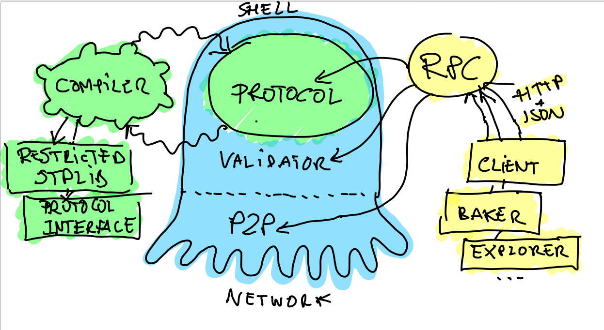

.. _part4:

***************
Part 4: Introduction to Tezos Pt 2
***************
Now with our blockchain background, let’s look at an overview of Tezos.

Self-Amendment
=============================
Self-amendment allows the Tezos blockchain to upgrade itself without having to fork the network into two different blockchains. This is important as the suggestion or expectation of a fork can divide the community, alter stakeholder incentives, and disrupt the network effects that are formed over time. Because of self-amendment, coordination and execution costs for protocol upgrades are reduced and future innovations can be seamlessly implemented.

On-Chain governance
=============================
In Tezos, all stakeholders can participate in governing the protocol. The election cycle provides a formal and systematic procedure for stakeholders to reach agreement on proposed protocol amendments. By combining this on-chain mechanism with self-amendment, Tezos can change this initial election process to adopt better governance mechanisms when they are discovered.

Decentralized Innovation
=============================
Proposed amendments that are accepted by stakeholders can include payment to individuals or groups that improve the protocol. This funding mechanism encourages robust participation and decentralizes the maintenance of the network. Fostering an active, open, and diverse developer ecosystem that is incentivized to contribute to the protocol will facilitate Tezos development and adoption.

Smart Contracts & Formal Verification
=============================
Tezos offers a platform to create smart contracts and build decentralized applications that cannot be censored or shut-down by third parties. Furthermore, Tezos facilitates formal verification, a technique used to improve security by mathematically proving properties about programs such as smart contracts. This technique, if used properly, can help avoid costly bugs and the contentious debates that follow.

Proof-of-Stake
=============================
Participants (“nodes”) in decentralized, peer-to-peer networks provide the necessary computational resources that keep a network up and running. Proof-of-Stake (PoS) is the mechanism by which the various participants in Tezos reach consensus on the state of the blockchain. Unlike other PoS protocols, any stakeholder can participate in the consensus process in Tezos and be rewarded by the protocol itself for contributing to the security and stability of the network. Additionally, PoS is less costly than other consensus mechanisms and lowers the barriers to entry for involvement.

Delegation
=============================
In Proof of Stake, a security deposit is required to participate in the consensus process. As in Proof-of-Work, the consensus protocol relies on an honest majority for its security which is incentivized directly by the Tezos protocol by penalizing dishonest behavior and rewarding honest behavior. If a participant behaves dishonestly, they can lose their deposit. Users who do not wish to participate directly in the consensus protocol have the option to delegate their rights to other users to participate on their behalf.

Baking
=============================
“Baking” is the act of signing and publishing blocks to the Tezos blockchain. Bakers are a crucial component of the Proof-of-Stake consensus mechanism by ensuring that all transactions in a block are correct, that the order of transactions is agreed upon, and that no double-spending has occurred.

Architecture
=============================
The diagram below shows a very coarse grained architecture of Tezos.

The characteristic that makes Tezos unique is its self-amending property. The part that amends itself is called the economic protocol (the green eye of the octopus), sometimes abbreviated by protocol or even proto in the source code. The rest of a Tezos node is what we call the shell (the blue octopus).

The protocol is responsible for interpreting the transactions and other administrative operations. It also has the responsibility to detect erroneous blocks. An important thing to notice is that the protocol always sees only one block chain. In other words, a linear sequence of blocks since the genesis. It does not know that it lives in an open network where nodes can propose alternative heads.

Only the shell knows about the multiple heads. It is responsible for choosing between the various chain proposals that come from the bakers (the programs that cook new blocks) of the network. The shell has the responsibility of selecting and downloading alternative chains, feed them to the protocol, which in turn has the responsibility to check them for errors, and give them an absolute score. The shell then simply selects the valid head of highest absolute score. This part of the shell is called the validator.

The rest of the shell includes the peer-to-peer layer, the disk storage of blocks, the operations to allow the node to transmit the chain data to new nodes and the versioned state of the ledger. In-between the validator, the peer-to-peer layer and the storage sits a component called the distributed database, that abstracts the fetching and replication of new chain data to the validator.

Protocols are compiled using a tweaked OCaml compiler (green part on the left of the picture) that does two things. First, it checks that the protocol’s main module has the right type. A good analogy is to see protocol as plug-ins, and in this case, it means that it respects the common plugin interface. Then, it restricts the typing environment of the protocol’s code so that it only calls authorized modules and functions. Seeing protocols as plug-ins, it means that the code only called primitives from the plug-in API. It is a form of statically enforced sandboxing.

Finally, the RPC layer (in yellow on the right in the picture) is an important part of the node. It is how the client, third party applications and daemons can interact with the node and introspect its state. This component uses the mainstream JSON format and HTTP protocol. It uses in-house libraries ocplib-resto and ocplib-json-typed (via the module Data_encoding). It is fully inter-operable, and auto descriptive, using JSON schema.

Additional Reading
=============================

`Tezos Infrastructure <http://tezos.gitlab.io/mainnet/whitedoc/the_big_picture.html#the-big-picture/>`_

`Tezos Proof of Stake <http://tezos.gitlab.io/mainnet/whitedoc/proof_of_stake.html/>`_

Credit to Dynamic Ledger Solutions
-----------------
